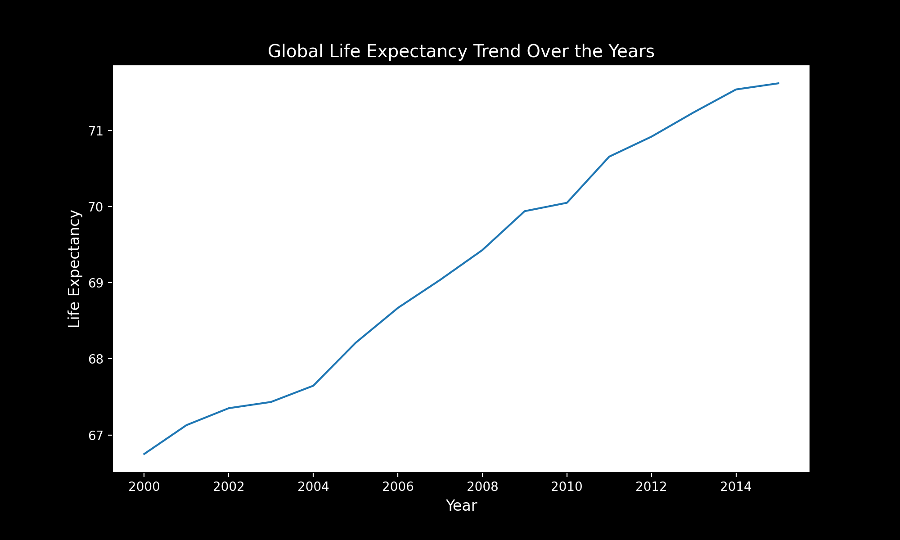
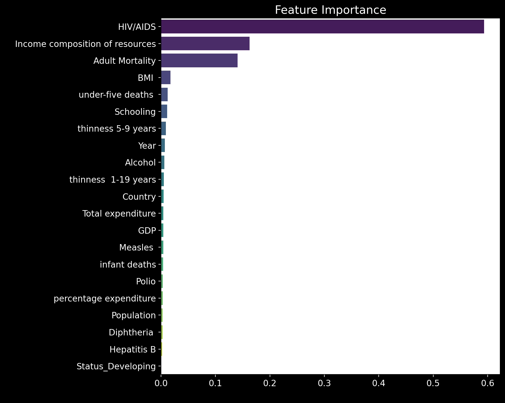

# Life Expectancy Prediction Using Machine Learning

This project utilises machine learning techniques to predict life expectancy based on socioeconomic and health factors, using a dataset from the World Health Organisation (WHO). The project includes data preprocessing, exploratory data analysis (EDA), model training, and evaluation.

---

## Project Overview

Life expectancy is a critical metric used to gauge the overall health and well-being of populations globally. This project aims to explore the factors influencing life expectancy and develop a predictive model that provides actionable insights.

The dataset includes indicators such as GDP, schooling, healthcare expenditure, mortality rates, and more. Using this information, we build machine learning models to predict life expectancy.

---

## Dataset

The dataset used in this project is publicly available on Kaggle:  
[Life Expectancy Data](https://www.kaggle.com/kumarajarshi/life-expectancy-who).

### Description:
The dataset contains various health, economic, and demographic indicators for countries worldwide, including:
- **Life Expectancy:** Target variable
- **Year:** Year of observation
- **Status:** Developed or Developing countries
- **Adult Mortality:** Mortality rate of adults
- **Alcohol Consumption:** Per capita alcohol consumption
- **GDP, Schooling, Population:** Economic and demographic indicators
- **Hepatitis B, Polio, Diphtheria Vaccinations:** Vaccination coverage
- **HIV/AIDS:** Prevalence rate and its impact

---

## Machine Learning Model

### Model Used: Random Forest Regressor

#### Why Random Forest?
- **Handles Complex Relationships:** Random Forest is well-suited for datasets with both linear and non-linear relationships between features.
- **Outlier Resilience:** It is robust to outliers, which were identified and handled during preprocessing.
- **Feature Importance:** The model provides an intuitive way to evaluate which features have the most impact on the target variable (Life Expectancy).
- **Good Generalisation:** Random Forest prevents overfitting by using an ensemble of decision trees.

#### Model Performance
The model achieved the following performance metrics:
- **Mean Absolute Error (MAE):** 1.07 years
- **Mean Squared Error (MSE):** 2.77 years²
- **R² Score:** 0.97

These metrics indicate an excellent model performance with high predictive power.

---

## Workflow

1. **Exploratory Data Analysis (EDA):**
   - Visualisations such as histograms, correlation heatmaps, and pair plots were used to understand data distribution and relationships.
   - Outliers were detected using IQR and Z-Score methods.

   **Visualisations:**
   - **GDP vs. Life Expectancy:**
     
   - **Average Life Expectancy by Status:**
     
   - **Life Expectancy Trend Over Years:**
     
   - **Correlation Heatmap:**
     

2. **Data Preprocessing:**
   - Missing values were filled using the median for numerical features.
   - Categorical features (`Country` and `Status`) were encoded:
     - `Status`: One-Hot Encoding was applied to avoid introducing ordinal relationships.
     - `Country`: Label Encoding was applied due to the large number of unique categories.
   - Features were scaled to have a mean of 0 and a standard deviation of 1.

3. **Model Training:**
   - A Random Forest Regressor was trained using an 80-20 train-test split.
   - Feature scaling was applied to standardise the data for improved model performance.

4. **Evaluation:**
   - The model was evaluated using MAE, MSE, and R² metrics.

---

## Results

- The Random Forest model identified **HIV/AIDS** and **Income composition of resources** as the most important features for predicting life expectancy.
- Feature importance analysis is visualised below:
  
  

---

## Key Insights

- **GDP vs. Life Expectancy:** The scatter plot demonstrates a positive correlation between GDP and life expectancy. Countries with higher GDP tend to have a higher life expectancy, highlighting the impact of economic development on public health.
- **Average Life Expectancy by Status:** The bar chart reveals that developed countries have significantly higher average life expectancy compared to developing nations. This aligns with better healthcare infrastructure and living conditions in developed countries.
- **Life Expectancy Trend Over Years:** The line plot indicates a gradual increase in global life expectancy over the years, reflecting improvements in medical advancements, nutrition, and overall quality of life.
- **Correlation Heatmap:** The heatmap showcases strong correlations between life expectancy and factors such as schooling, income composition, and healthcare expenditure, reinforcing the importance of socioeconomic factors in predicting life expectancy.

- **Socioeconomic factors are critical:** Features like **GDP** and **Income composition of resources** are the most important predictors of life expectancy, as shown by feature importance analysis.
- **Health indicators are significant:** Factors such as **HIV/AIDS prevalence** and vaccination rates (e.g., Polio, Hepatitis B) show a strong relationship with life expectancy.
- **Outliers matter:** Outlier detection and handling improved model performance by ensuring robust predictions.
- **Random Forest works well for this data:** The model achieved a high R² score of **0.97**, indicating very strong predictive power.

---
